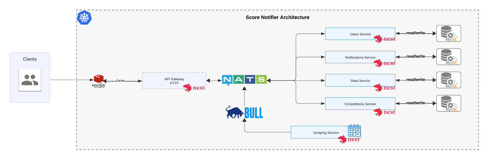

## Local Setup

1. Clone the repository.
2. Create a `.env` file based on `.env.example`.
3. Update submodules with `git submodule update --init --recursive`.
4. Ensure Docker is running locally.
5. Run `docker compose up --build`.
6. The API Gateway will be accessible at `http://localhost:<PORT>`, where `<PORT>` is the port defined in the `docker-compose.yml` file.

To update the submodule references, you can run the following command: `git submodule update --remote`.

## Run e2e tests

For simplicity, I mock the NATS server and only have positive tests. Negative tests should be added to test the error handling in the future.

If I want to test the actual communication with the microservices, I will need to have all the microservices running, probably already deployed in a cloud provider, and run the e2e tests against them with CI/CD pipelines.

1. Go to the e2e directory: `cd api-gateway`
2. Run the e2e Docker Compose setup: `docker compose up --build -d`
3. Run the e2e script: `npm run test:e2e`

## Architecture Overview

### API Gateway

The API Gateway is the only entry point exposed to the outside world. It receives HTTP requests from clients and routes them to the appropriate microservices. This gateway ensures security and acts as a single point of management for client interactions.

### Cache

At this moment, the app uses Redis to cache only the API Gateway GET requests.

### Microservices

- **API Gateway**
  - **Communication**: Via NATS with other microservices.
  - **Cache**: Uses Redis to cache GET requests. For testing purposes, a TTL of 1 minute is set for every GET request.

- **Scraping Microservice**
  - **Functionality**: When the project starts, the scraping microservice runs a league scheduler and a live matches scheduler using Bull to handle queues. This setup helps distribute the load and allows the user to adjust concurrency, limiters, and cron expressions to manage available resources.
  - **Communication**: Via NATS with other microservices and Redis to handle queues using Bull.

- **Users Microservice**
  - **Functionality**: The users microservice stores user profiles and user subscriptions.
  - **Database**: MySQL
  - **Communication**: Via NATS with other microservices and the API Gateway.

- **Competitions Microservice**
  - **Functionality**: The competitions microservice stores leagues, teams, and matches.
  - **Database**: MySQL
  - **Communication**: Via NATS with other microservices and the API Gateway.

- **Notifications Microservice**
  - **Functionality**: This microservice will send live match notifications to active user subscriptions.
  - **Database**: MySQL
  - **Communication**: Via NATS with other microservices and the API Gateway.

- **Stats Microservice**
  - **Functionality**: This microservice will handle statistical data.
  - **Database**: MySQL
  - **Communication**: Via NATS with other microservices and the API Gateway.

### Docker and Docker-Compose

Each microservice is containerized using Docker to ensure consistency and portability across different environments. A project launcher uses Docker-Compose to bring up the necessary databases and microservices together, facilitating development and deployment.

## Benefits of the Architecture

1. **Scalability**: Each microservice can be scaled independently based on its specific needs and traffic. This flexibility allows efficient resource utilization and better performance under load.
2. **Isolation**: By having independent MySQL databases for each microservice, the system ensures data encapsulation and reduces the risk of data corruption or unintended interference between services.
3. **Modularity**: The microservices architecture promotes modular development. Teams can work on different services simultaneously without causing disruptions to the entire system.
4. **Maintainability**: Smaller, well-defined services are easier to manage, update, and debug. It also allows for the adoption of new technologies in specific parts of the system without a complete overhaul.
5. **Resilience**: Faults in one microservice do not affect the entire system. This isolation improves the overall resilience and reliability of the application.

## HTTP Requests

Import the Postman collections to interact with the API.

[Application Endpoints](./postman-collections/)

## Kubernetes

The app is partially working with Kubernetes and GCloud; however, more time is needed to complete the effort.

## Pending Work

- [X] Add stats microservice.
- [X] Add notifications when a live game is in progress.
- [X] Add missing endpoints.
- [X] Add CI/CD.
- [X] Add Kubernetes.
- [X] Upload the project to a cloud provider.
- [X] Add production environment.
- [X] Add caching with Redis - API Gateway.
- [X] Add API Gateway integration/e2e tests.
- [ ] Add caching with Redis - Microservices.
- [ ] Cache invalidation.
- [ ] Add authentication and authorization.
- [ ] Add unit tests.
- [ ] Add monitoring.